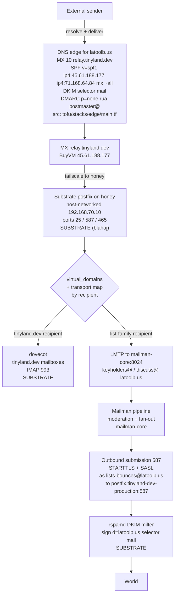
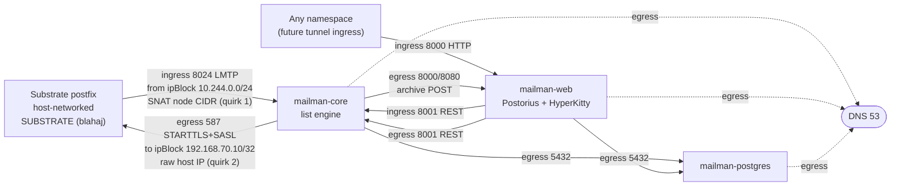
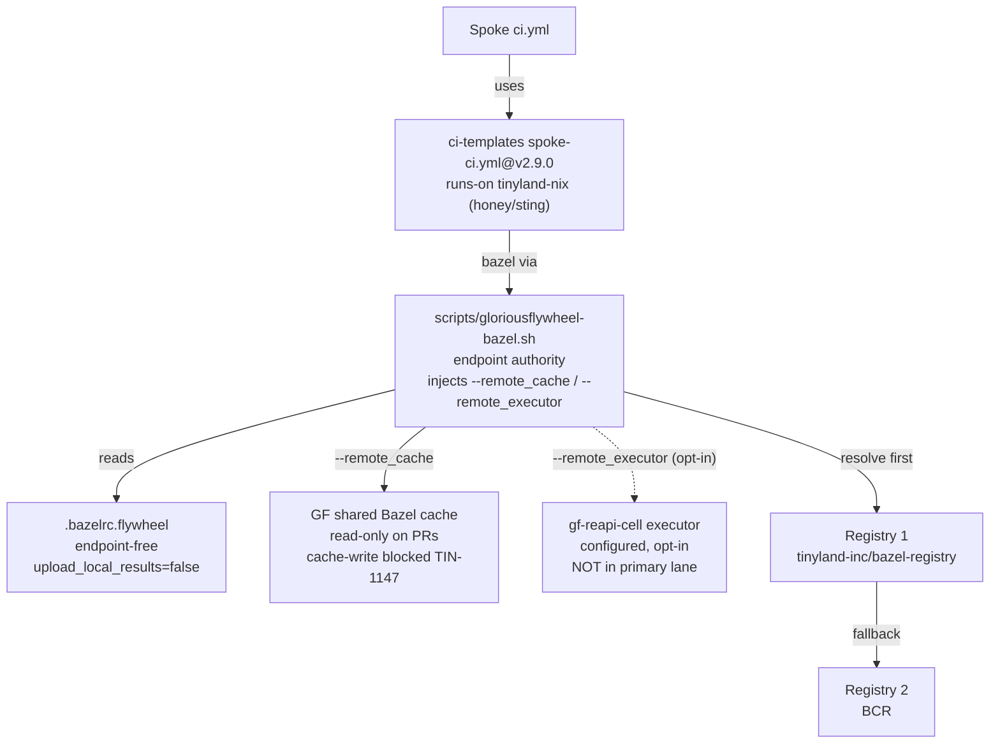

# Architecture diagrams

Grounded mermaid diagrams for the Great Falls Tool Bus (GFTB) apply-plane
overlay. Every diagram cites the source-of-truth files it is drawn from, all in
this repository unless noted. Substrate-owned facts (postfix, dovecot, rspamd,
the DKIM key material, the transport map) live in `tinyland-inc/blahaj` and are
consumed by reference through named contracts; they are labelled as substrate
in the diagrams and are not committed here.

Live state was verified read-only against the `honey` cluster on 2026-07-04
(namespaces `latoolb-us-production` and `tinyland-dev-production`, get/describe
only). Pod, Service, and NetworkPolicy shapes below match that live state.

## 1. Mail flow, end to end

**Claim.** Inbound mail for `latoolb.us` enters through the house MX
`relay.tinyland.dev`, reaches the host-networked substrate postfix on honey,
and is split by the transport map: `tinyland.dev` mailboxes land in dovecot,
while the `keyholders@` and `discuss@` list families are delivered by
recipient-scoped LMTP to `mailman-core:8024`. Mailman moderates and fans out,
then submits outbound over 587 STARTTLS with SASL as `lists-bounces@latoolb.us`;
the substrate rspamd milter adds the `d=latoolb.us` DKIM signature (selector
`mail`) before the message leaves for the world. The DNS edge authorizes both
egress IPs in SPF and publishes MX, DKIM, and a start-observing DMARC record.

**Sources of truth.** Edge DNS records: `tofu/stacks/edge/main.tf` (MX ->
`relay.tinyland.dev`, `priority 10`; SPF `v=spf1 ip4:45.61.188.177
ip4:71.168.64.84 mx ~all`; DMARC `p=none`; DKIM selector `mail`, all gated on
`var.mail_dns_enabled`). LMTP target: `k8s/list/latoolb-us-production/service-mailman-core.yaml`
(port `8024`) and `docs/runbooks/list-bringup.md` pre-apply gate 1 (transport
`<list-domain> lmtp:[mailman-core.latoolb-us-production.svc.cluster.local]:8024`).
Outbound submission: `k8s/list/latoolb-us-production/deployment-mailman-core.yaml`
and `configmap-mailman.yaml` (`SMTP_HOST
postfix.tinyland-dev-production.svc.cluster.local`, `SMTP_PORT 587`,
`smtp_secure_mode starttls`, SASL from the `lists-bounces-smtp` Secret). DKIM
selector: `k8s/mail/latoolb-us-production/maildomain-latoolb-us.yaml`
(`dkimSelector: mail`). Substrate postfix/dovecot/rspamd and the DKIM private
key are blahaj-owned (ADR 010). The `45.61.188.177` relay and `71.168.64.84`
honey egress facts are the SPF comment in `tofu/stacks/edge/main.tf`.

## 2. Network and ports: `latoolb-us-production` NetworkPolicy graph

**Claim.** The namespace is default-deny; each Mailman pod is opened only for
the flows drawn here. `mailman-core` admits LMTP `8024` from the flannel node
CIDR `10.244.0.0/24` (not a podSelector) because the substrate postfix is
host-networked and its source is SNAT'd to the node CIDR on the ingress leg; it
admits REST `8001` from `mailman-web`. On egress, `mailman-core` reaches the
substrate postfix at the raw host IP `192.168.70.10/32` on `587` (destination
is not SNAT'd, the asymmetric quirk), Postgres on `5432`, `mailman-web` on
`8000`/`8080` for the HyperKitty archive POST, plus DNS. `mailman-web` admits
HTTP `8000` from any namespace and egresses to core REST `8001` and Postgres
`5432`. `mailman-postgres` admits `5432` only from core and web.

**Source of truth.** `k8s/list/latoolb-us-production/networkpolicy.yaml`
verbatim (ingress CIDR `10.244.0.0/24` at lines 37-42; egress host IP
`192.168.70.10/32` at lines 65-70; core -> web `8000`/`8080` at lines 85-93;
web ingress `namespaceSelector {}` on `8000` at lines 115-119). The two
asymmetric host-networked quirks are annotated in that file's comments (ingress
sees the SNAT node CIDR; egress targets the raw host IP). Live pod IPs on
2026-07-04 (`mailman-core 10.244.0.17`) confirm the `10.244.0.0/24` node CIDR.

## 3. Repository and plane topology

**Claim.** Three planes with a strict artifact boundary. The public spoke
`greatfallstoolbus.org` is declare-only and holds zero secrets: it emits
`tofu/dns-intent/` and `tofu/mail-intent/` intent that names, but never
applies, mail and list posture. This overlay, `great-falls-tool-bus-infra`, is
the org apply plane: it runs `tofu` apply for the edge/DNS zones, owns the
`mail.tinyland.dev` custom resources (`MailDomain`, `MailAccount`, `MailAlias`)
and the Mailman list stack, and gates applies behind the protected `mail`
environment. The blahaj substrate owns postfix, dovecot, rspamd, the transport
map, and the DKIM keys; it is swappable behind the named contracts of ADR
009/010. Intent flows spoke -> overlay; CRs and manifests apply overlay ->
cluster; transport-map lines and DKIM material stay substrate-side.

**Sources of truth.** Spoke intent: `greatfallstoolbus.org`
`tofu/mail-intent/intent.yaml` (`applied_by: great-falls-tool-bus-infra`, "No
endpoints, no state, no credentials, ever"). Overlay apply role and CR
ownership: `README.md` ("Mail CR apply plane (TIN-2379)", "Edge/DNS apply
plane") and `k8s/mail/latoolb-us-production/` (`MailDomain`/`MailAccount`/
`MailAlias`). Environment gate: `.github/workflows/mail-crs.yml` and
`list-crs.yml` (`environment: mail`, `MAIL_APPLY_KUBECONFIG_B64`). Substrate
boundary and contracts: `k8s/mail/README.md`, `docs/runbooks/list-bringup.md`
(ADR 010 / `tenant-list-engine-smtp` contract, blahaj as "replaceable IaC layer
consumed as a service").

## 4. Bazel and GloriousFlywheel flow

**Claim.** The public spoke's `ci.yml` is a thin wrapper over
`tinyland-inc/ci-templates` `spoke-ci.yml`, pinned at `v2.9.0`, running on the
`tinyland-nix` runner class (honey/sting pool). Bazel work goes through the
`scripts/gloriousflywheel-bazel.sh` wrapper, which holds the endpoint authority
and injects `--remote_cache` (and, only when executor mode is selected,
`--remote_executor`) so `.bazelrc.flywheel` stays endpoint-free. Registries
resolve `tinyland-inc/bazel-registry` first, then BCR. The shared cache is
read-only on PRs (`--remote_upload_local_results=false`); the `gf-reapi-cell`
executor is configured as a documented substrate fact but is opt-in and not
wired into the primary lane, and cache-write publication is blocked pending
TIN-1147.

**Sources of truth.** Runner class and template pin:
`greatfallstoolbus.org` `.github/workflows/ci.yml`
(`uses: tinyland-inc/ci-templates/.github/workflows/spoke-ci.yml@v2.9.0`,
`default_runner_class: tinyland-nix`, `flywheel_config: flywheel`,
`cache_backed: true`). Registry chain and endpoint-free posture:
`greatfallstoolbus.org` `.bazelrc` (two `--registry` lines, bazel-registry
first) and `.bazelrc.flywheel` (`remote_upload_local_results=false`, TIN-1147
invariant, `flywheel-executor` config separate and tag-gated). Wrapper
authority: `greatfallstoolbus.org` `scripts/gloriousflywheel-bazel.sh` and
`Justfile` `flywheel-*` recipes. Executor endpoint as documented-only fact:
this repo's `README.md` ("Shared Bazel executor
`grpc://gf-reapi-cell.gf-rbe.svc.cluster.local:8980`, documented substrate
fact, NOT wired into the primary lane yet").

