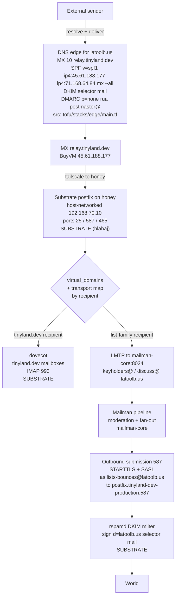
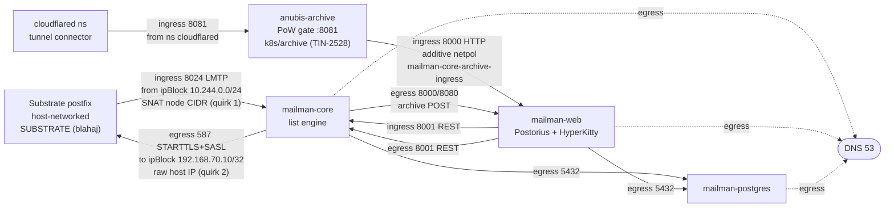
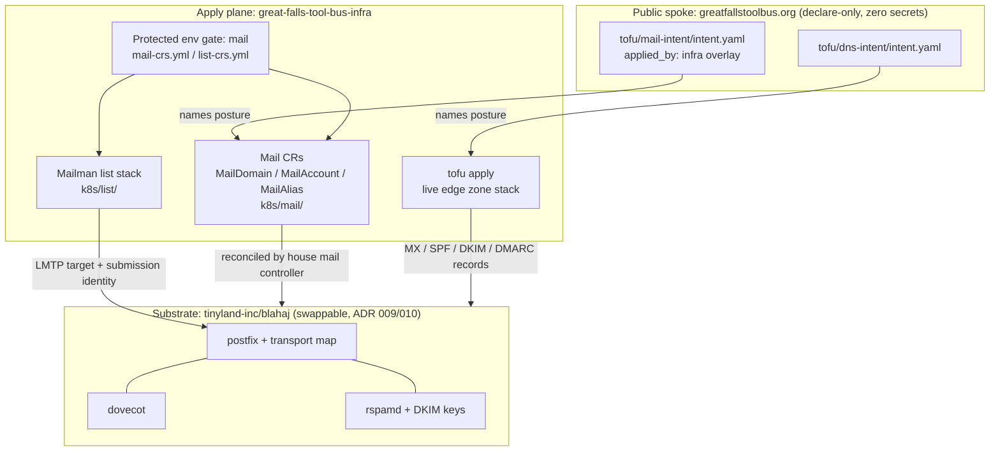
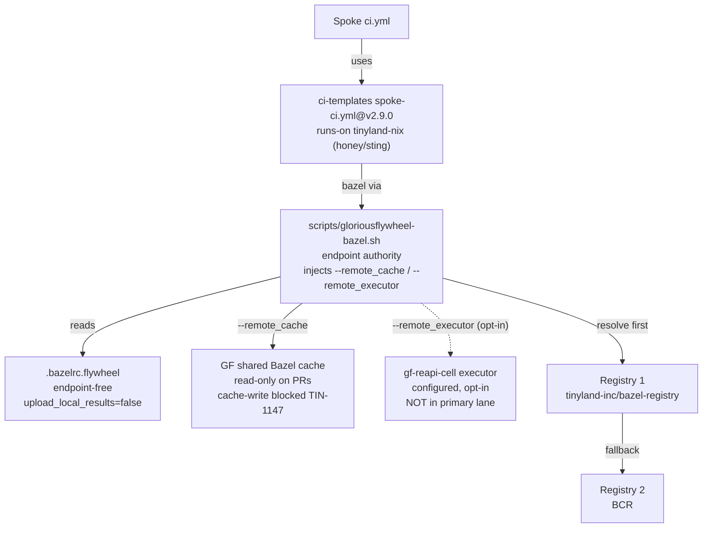
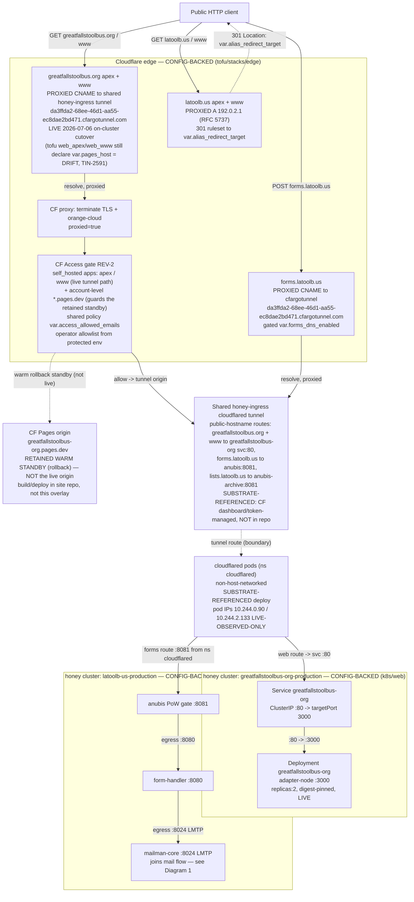

# Architecture diagrams

Grounded mermaid diagrams for the Great Falls Tool Bus (GFTB) apply-plane
overlay. Every diagram cites the source-of-truth files it is drawn from, all in
this repository unless noted. Substrate-owned facts (postfix, dovecot, rspamd,
the DKIM key material, the transport map) live in `tinyland-inc/blahaj` and are
consumed by reference through named contracts; they are labelled as substrate
in the diagrams and are not committed here.

Live state was verified read-only against the `honey` cluster on 2026-07-04
(namespaces `latoolb-us-production` and `tinyland-dev-production`, get/describe
only). Pod, Service, and NetworkPolicy shapes below match that live state.

## 1. Mail flow, end to end

**Claim.** Inbound mail for `latoolb.us` enters through the house MX
`relay.tinyland.dev`, reaches the host-networked substrate postfix on honey,
and is split by the transport map: `tinyland.dev` mailboxes land in dovecot,
while the `keyholders@` and `discuss@` list families are delivered by
recipient-scoped LMTP to `mailman-core:8024`. Mailman moderates and fans out,
then submits outbound over 587 STARTTLS with SASL as `lists-bounces@latoolb.us`;
the substrate rspamd milter adds the `d=latoolb.us` DKIM signature (selector
`mail`) before the message leaves for the world. The DNS edge SPF authorizes the
one real egress IP `71.168.64.84` (the host-networked postfix on honey egresses
direct-to-MX, SNAT'd at the CRS309 to the Fidium static WAN; wire-proven
2026-07-04) plus the inbound MX/relay `45.61.188.177` (`relay.tinyland.dev`,
inbound-only, not an egress path), and publishes MX, DKIM, and a start-observing
DMARC record.

**Sources of truth.** Edge DNS records: `tofu/stacks/edge/main.tf` (MX ->
`relay.tinyland.dev`, `priority 10`; SPF `v=spf1 ip4:45.61.188.177
ip4:71.168.64.84 mx ~all`; DMARC `p=none`; DKIM selector `mail`, all gated on
`var.mail_dns_enabled`). LMTP target: `k8s/list/latoolb-us-production/service-mailman-core.yaml`
(port `8024`) and `docs/runbooks/list-bringup.md` pre-apply gate 1 (transport
`<list-domain> lmtp:[mailman-core.latoolb-us-production.svc.cluster.local]:8024`).
Outbound submission: `k8s/list/latoolb-us-production/deployment-mailman-core.yaml`
and `configmap-mailman.yaml` (`SMTP_HOST
postfix.tinyland-dev-production.svc.cluster.local`, `SMTP_PORT 587`,
`smtp_secure_mode starttls`, SASL from the `lists-bounces-smtp` Secret). DKIM
selector: `k8s/mail/latoolb-us-production/maildomain-latoolb-us.yaml`
(`dkimSelector: mail`). Substrate postfix/dovecot/rspamd and the DKIM private
key are blahaj-owned (ADR 010). The `45.61.188.177` relay and `71.168.64.84`
honey egress facts are the SPF comment in `tofu/stacks/edge/main.tf`.

## 2. Network and ports: `latoolb-us-production` NetworkPolicy graph

**Claim.** The namespace is default-deny; each Mailman pod is opened only for
the flows drawn here. `mailman-core` admits LMTP `8024` from the flannel node
CIDR `10.244.0.0/24` (not a podSelector) because the substrate postfix is
host-networked and its source is SNAT'd to the node CIDR on the ingress leg; it
admits REST `8001` from `mailman-web`. On egress, `mailman-core` reaches the
substrate postfix at the raw host IP `192.168.70.10/32` on `587` (destination
is not SNAT'd, the asymmetric quirk), Postgres on `5432`, `mailman-web` on
`8000`/`8080` for the HyperKitty archive POST, plus DNS. The web tier admits
HTTP `8000` from a scoped set of namespaces, no longer "any": the LIVE public
`discuss@` archive leg reaches it through the shared honey-ingress tunnel as
`cloudflared` ns -> `anubis-archive:8081` (the k8s/archive PoW gate, TIN-2528)
-> web `:8000`, admitted by the additive `mailman-core-archive-ingress`
NetworkPolicy. `mailman-postgres` admits `5432` only from core and web.

**Source of truth.** `k8s/list/latoolb-us-production/networkpolicy.yaml`
verbatim (ingress CIDR `10.244.0.0/24` at lines 37-42; egress host IP
`192.168.70.10/32` at lines 65-70; core -> web `8000`/`8080` at lines 85-93;
the web-tier `:8000` ingress admits a scoped namespace set — `cloudflared`,
`arc-runners`, `greatfallstoolbus-org-production` — folded into the `mailman-core`
policy after the standalone `mailman-web` policy was retired (TIN-2493, web tier
now co-located in the `mailman-core` pod). The LIVE archive leg's admission is
the additive `mailman-core-archive-ingress` rule in
`k8s/archive/latoolb-us-production/networkpolicy.yaml`. The two
asymmetric host-networked quirks are annotated in that file's comments (ingress
sees the SNAT node CIDR; egress targets the raw host IP). Live pod IPs on
2026-07-04 (`mailman-core 10.244.0.17`) confirm the `10.244.0.0/24` node CIDR.

## 3. Repository and plane topology

**Claim.** Three planes with a strict artifact boundary. The public spoke
`greatfallstoolbus.org` is declare-only and holds zero secrets: it emits
`tofu/dns-intent/` and `tofu/mail-intent/` intent that names, but never
applies, mail and list posture. This overlay, `great-falls-tool-bus-infra`, is
the org apply plane: it runs `tofu` apply for the edge/DNS zones, owns the
`mail.tinyland.dev` custom resources (`MailDomain`, `MailAccount`, `MailAlias`)
and the Mailman list stack, and gates applies behind the protected `mail`
environment. The blahaj substrate owns postfix, dovecot, rspamd, the transport
map, and the DKIM keys; it is swappable behind the named contracts of ADR
009/010. Intent flows spoke -> overlay; CRs and manifests apply overlay ->
cluster; transport-map lines and DKIM material stay substrate-side.

**Sources of truth.** Spoke intent: `greatfallstoolbus.org`
`tofu/mail-intent/intent.yaml` (`applied_by: great-falls-tool-bus-infra`, "No
endpoints, no state, no credentials, ever"). Overlay apply role and CR
ownership: `README.md` ("Mail CR apply plane (TIN-2379)", "Edge/DNS apply
plane") and `k8s/mail/latoolb-us-production/` (`MailDomain`/`MailAccount`/
`MailAlias`). Environment gate: `.github/workflows/mail-crs.yml` and
`list-crs.yml` (`environment: mail`, `MAIL_APPLY_KUBECONFIG_B64`). Substrate
boundary and contracts: `k8s/mail/README.md`, `docs/runbooks/list-bringup.md`
(ADR 010 / `tenant-list-engine-smtp` contract, blahaj as "replaceable IaC layer
consumed as a service").

## 4. Bazel and GloriousFlywheel flow

**Claim.** The public spoke's `ci.yml` is a thin wrapper over
`tinyland-inc/ci-templates` `spoke-ci.yml`, pinned at `v2.9.0`, running on the
`tinyland-nix` runner class (honey/sting pool). Bazel work goes through the
`scripts/gloriousflywheel-bazel.sh` wrapper, which holds the endpoint authority
and injects `--remote_cache` (and, only when executor mode is selected,
`--remote_executor`) so `.bazelrc.flywheel` stays endpoint-free. Registries
resolve `tinyland-inc/bazel-registry` first, then BCR. The shared cache is
read-only on PRs (`--remote_upload_local_results=false`); the `gf-reapi-cell`
executor is configured as a documented substrate fact but is opt-in and not
wired into the primary lane, and cache-write publication is blocked pending
TIN-1147.

**Sources of truth.** Runner class and template pin:
`greatfallstoolbus.org` `.github/workflows/ci.yml`
(`uses: tinyland-inc/ci-templates/.github/workflows/spoke-ci.yml@v2.9.0`,
`default_runner_class: tinyland-nix`, `flywheel_config: flywheel`,
`cache_backed: true`). Registry chain and endpoint-free posture:
`greatfallstoolbus.org` `.bazelrc` (two `--registry` lines, bazel-registry
first) and `.bazelrc.flywheel` (`remote_upload_local_results=false`, TIN-1147
invariant, `flywheel-executor` config separate and tag-gated). Wrapper
authority: `greatfallstoolbus.org` `scripts/gloriousflywheel-bazel.sh` and
`Justfile` `flywheel-*` recipes. Executor endpoint as documented-only fact:
this repo's `README.md` ("Shared Bazel executor
`grpc://gf-reapi-cell.gf-rbe.svc.cluster.local:8980`, documented substrate
fact, NOT wired into the primary lane yet").

## 5. Public -> cluster HTTP edge path

**Claim.** Every inbound HTTP request for the GFTB properties enters at the
Cloudflare edge and takes one of three paths. (a) `greatfallstoolbus.org` apex
and `www` are, as of the 2026-07-06 on-cluster cutover, served **LIVE from the
cluster**: they resolve to a proxied CNAME to the shared honey-ingress
cloudflared tunnel (`da3ffda2-68ee-46d1-aa55-ec8dae2bd471.cfargotunnel.com`), the
CF edge terminates TLS, and Cloudflare Access still gates the surface via the
apex and www self-hosted apps (plus the **account-level**
`*.greatfallstoolbus-org.pages.dev` app that now guards the retained Pages
standby), all sharing one allowlist policy (`var.access_allowed_emails`, supplied
from protected operator custody); an allowed request is carried through the
tunnel to the in-cluster `adapter-node` web Deployment behind `Service
greatfallstoolbus-org.greatfallstoolbus-org-production:80` (ClusterIP `:80` ->
containerPort `3000`; `k8s/web`, `replicas:2`, digest-pinned). CF Pages is
retained only as a **warm rollback standby, no longer the live origin.** NOTE
(in-repo drift): the `tofu/stacks/edge` `web_apex`/`web_www` records still
declare a proxied CNAME to `var.pages_host`; the tunnel repoint is the live
dashboard-side state pending a tofu reconcile (TIN-2591, the TIN-991 successor).
(b)
`forms.latoolb.us` is a proxied
CNAME to the shared honey-ingress cloudflared tunnel
(`da3ffda2-68ee-46d1-aa55-ec8dae2bd471.cfargotunnel.com`, gated
`var.forms_dns_enabled`); the tunnel's public-hostname route
(`forms.latoolb.us -> anubis:8081`) is Cloudflare-dashboard/token-managed and is
**not** in this repo, so it is drawn as an explicit boundary. Past it the
non-host-networked `cloudflared` pods (namespace `cloudflared`) reach the
in-cluster form chain admitted by the `latoolb-us-production` NetworkPolicy:
`anubis` PoW gate `:8081` -> `form-handler` `:8080` -> `mailman-core` `:8024`
LMTP (which then joins the mail flow, Diagram 1). (c) `latoolb.us` apex and
`www` are a proxied `192.0.2.1` (RFC 5737 documentation IP the proxy answers
in front of) plus a 301 redirect ruleset to `var.alias_redirect_target`. The
`greatfallstoolbus.org` web surface (a) is now served on-cluster; the
`latoolb.us` alias path serves no content of its own.

**Sources of truth.** Web edge + Access: `tofu/stacks/edge/main.tf`
(`web_apex`/`web_www` still declare a proxied CNAME -> `var.pages_host` at lines
42-58 — this is the pre-cutover DECLARED target and is now DRIFT vs the live
tunnel repoint, TIN-2591; the three `cloudflare_zero_trust_access_application` —
apex 65-76, www 83-94, account-level `pages_dev` with `self_hosted_domains` =
`greatfallstoolbus-org.pages.dev` + `*.greatfallstoolbus-org.pages.dev` at
103-114 — all binding the single
`cloudflare_zero_trust_access_policy.web_apex_allow` at 122-134) and
`tofu/stacks/edge/variables.tf` (`pages_host` default `greatfallstoolbus-org.pages.dev`
26-41; `access_allowed_emails` required operator input 15-26). LIVE on-cluster
serving tier: `k8s/web/greatfallstoolbus-org-production/` (`deployment.yaml`
`replicas: 2` + digest-pinned image; `service.yaml` ClusterIP `:80` ->
targetPort `3000`; `networkpolicy.yaml` cloudflared-ns admission), reconciled
LIVE per `k8s/web/README.md`. The tunnel public-hostname route
(`greatfallstoolbus.org`+`www` -> `greatfallstoolbus-org` svc `:80`) is
Cloudflare-dashboard/token-managed, NOT in this repo (same boundary as forms +
archive). Forms
CNAME: `tofu/stacks/edge/main.tf` `alias_forms` proxied CNAME ->
`da3ffda2-68ee-46d1-aa55-ec8dae2bd471.cfargotunnel.com`, `count = var.forms_dns_enabled`
(245-254); var at `variables.tf` 95-113. Alias redirect: `tofu/stacks/edge/main.tf`
`alias_apex` A `192.0.2.1` proxied (142-149), `alias_www` (151-158),
`cloudflare_ruleset.alias_redirect` 301 -> `var.alias_redirect_target` (256-277);
var at `variables.tf` 115-128. In-cluster form chain:
`k8s/form/latoolb-us-production/networkpolicy.yaml` (anubis ingress `8081` from
`namespaceSelector kubernetes.io/metadata.name: cloudflared` at 42-48; anubis
egress `8080` to form-handler at 57-63; form-handler ingress `8080` from anubis
at 81-87; form-handler egress `8024` LMTP to mailman-core at 103-109; the
TUNNEL-SOURCE FINDING comment 7-25 records cloudflared as a non-host-networked
Deployment with live pod IPs `10.244.0.90` (honey) / `10.244.2.133` (sting)).
Tunnel boundary: `k8s/form/latoolb-us-production/service-anubis.yaml` (ClusterIP
`8081`; comment 1-6 — the tunnel public-hostname -> `Service:8081` route lives in
the Cloudflare zero-trust dashboard/API, token-managed, NOT in this repo).

**Open / not-in-config.**

- The tunnel public-hostname ingress map (now `greatfallstoolbus.org`+`www` ->
  `greatfallstoolbus-org` svc `:80`, `forms.latoolb.us -> anubis:8081`, and
  `lists.latoolb.us -> anubis-archive:8081`) is Cloudflare zero-trust
  dashboard/API state, token-managed; not in this repo or any ConfigMap
  (`service-anubis.yaml` comment). Drawn as the dashed boundary. Bringing this
  full map into git is TIN-2591 (TIN-991 successor).
- `cloudflared` pod IPs (`10.244.0.90` honey / `10.244.2.133` sting) are
  LIVE-OBSERVED-ONLY (2026-07-04 read-only kubectl); not pinned in config — the
  netpol admits by `namespaceSelector`, not ipBlock, on this leg.
- The apex/www DNS repoint to the tunnel (2026-07-06 cutover) is live
  dashboard-side; the in-repo `tofu/stacks/edge` `web_apex`/`web_www` still
  declare `var.pages_host` and are DRIFT pending reconcile. CF Pages is retained
  as a warm rollback standby; its build/deploy config lives in the site repo
  (`greatfallstoolbus.org`), not this overlay.
- `var.forms_dns_enabled` default is `true` in `variables.tf` (the forms CNAME
  is live after the 2026-07-05 route + smoke proof).
