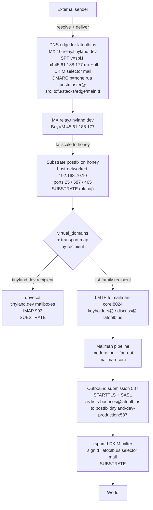
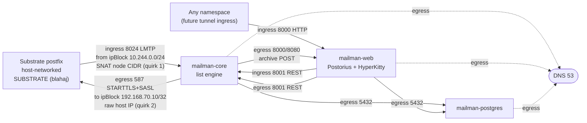
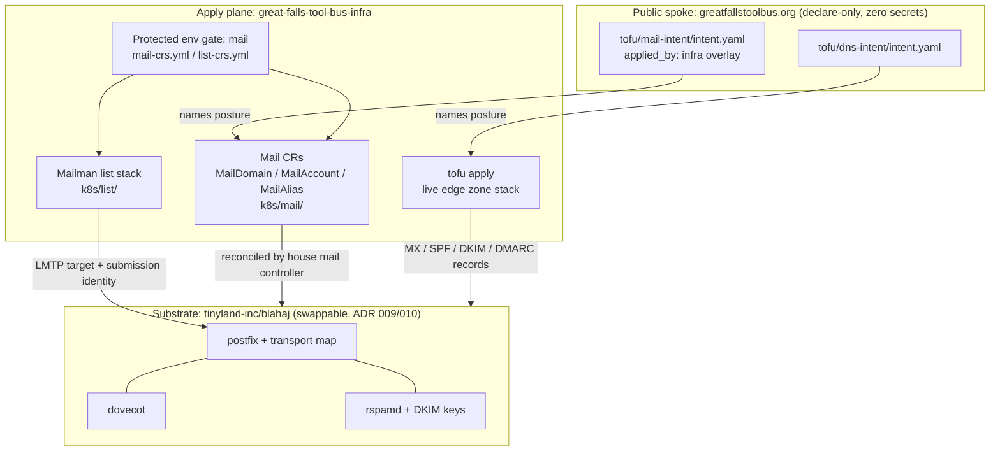
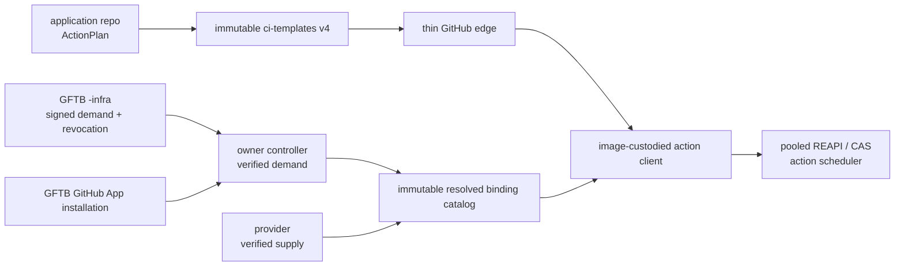
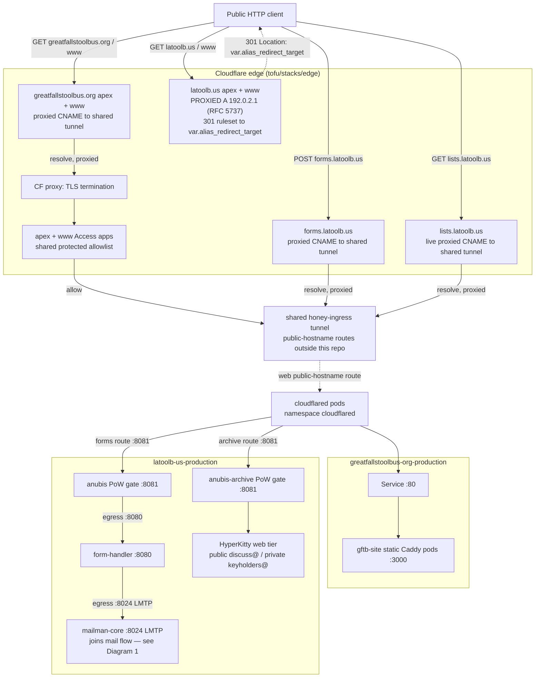

# Architecture diagrams

Grounded mermaid diagrams for the Great Falls Tool Bus (GFTB) apply-plane
overlay. Every diagram cites the source-of-truth files it is drawn from, all in
this repository unless noted. Substrate-owned facts (postfix, dovecot, rspamd,
the DKIM key material, the transport map) live in `tinyland-inc/blahaj` and are
consumed by reference through named contracts; they are labelled as substrate
in the diagrams and are not committed here.

Live state was verified read-only against the `honey` cluster on 2026-07-04
(namespaces `latoolb-us-production` and `tinyland-dev-production`, get/describe
only). Pod, Service, and NetworkPolicy shapes below match that live state.

## 1. Mail flow, end to end

**Claim.** Inbound mail for `latoolb.us` enters through the house MX
`relay.tinyland.dev`, reaches the host-networked substrate postfix on honey,
and is split by the transport map: `tinyland.dev` mailboxes land in dovecot,
while the `keyholders@` and `discuss@` list families are delivered by
recipient-scoped LMTP to `mailman-core:8024`. Mailman moderates and fans out,
then submits outbound over 587 STARTTLS with SASL as `lists-bounces@latoolb.us`;
the substrate rspamd milter adds the `d=latoolb.us` DKIM signature (selector
`mail`) before the message leaves for the world. The DNS edge authorizes the
FL relay egress IP in SPF and publishes MX, DKIM, and a start-observing DMARC
record.

**Sources of truth.** Edge DNS records: `tofu/stacks/edge/main.tf` (MX ->
`relay.tinyland.dev`, `priority 10`; SPF `v=spf1 ip4:45.61.188.177 mx ~all`;
DMARC `p=none`; DKIM selector `mail`, all gated on
`var.mail_dns_enabled`). LMTP target: `k8s/list/latoolb-us-production/service-mailman-core.yaml`
(port `8024`) and `docs/runbooks/list-bringup.md` pre-apply gate 1 (transport
`<list-domain> lmtp:[mailman-core.latoolb-us-production.svc.cluster.local]:8024`).
Outbound submission: `k8s/list/latoolb-us-production/deployment-mailman-core.yaml`
and `configmap-mailman.yaml` (`SMTP_HOST
postfix.tinyland-dev-production.svc.cluster.local`, `SMTP_PORT 587`,
`smtp_secure_mode starttls`, SASL from the `lists-bounces-smtp` Secret). DKIM
selector: `k8s/mail/latoolb-us-production/maildomain-latoolb-us.yaml`
(`dkimSelector: mail`). Substrate postfix/dovecot/rspamd and the DKIM private
key are blahaj-owned (ADR 010). The `45.61.188.177` relay egress fact and the
residential-fallback retirement are recorded in `tofu/stacks/edge/main.tf`.

```mermaid
flowchart TD
    sender["External sender"]
    dns["DNS edge for latoolb.us<br/>MX 10 relay.tinyland.dev<br/>SPF v=spf1 ip4:45.61.188.177 mx ~all<br/>DKIM selector mail<br/>DMARC p=none rua postmaster@<br/>src: tofu/stacks/edge/main.tf"]
    mx["MX relay.tinyland.dev<br/>BuyVM 45.61.188.177"]
    postfix["Substrate postfix on honey<br/>host-networked 192.168.70.10<br/>ports 25 / 587 / 465<br/>SUBSTRATE (blahaj)"]
    transport{"virtual_domains<br/>+ transport map<br/>by recipient"}
    dovecot["dovecot<br/>tinyland.dev mailboxes<br/>IMAP 993<br/>SUBSTRATE"]
    lmtp["LMTP to mailman-core:8024<br/>keyholders@ / discuss@ latoolb.us"]
    pipeline["Mailman pipeline<br/>moderation + fan-out<br/>mailman-core"]
    submit["Outbound submission 587<br/>STARTTLS + SASL<br/>as lists-bounces@latoolb.us<br/>to postfix.tinyland-dev-production:587"]
    rspamd["rspamd DKIM milter<br/>sign d=latoolb.us selector mail<br/>SUBSTRATE"]
    world["World"]

    sender -->|"resolve + deliver"| dns
    dns --> mx
    mx -->|"tailscale to honey"| postfix
    postfix --> transport
    transport -->|"tinyland.dev recipient"| dovecot
    transport -->|"list-family recipient"| lmtp
    lmtp --> pipeline
    pipeline --> submit
    submit --> rspamd
    rspamd --> world
```

## 2. Network and ports: `latoolb-us-production` NetworkPolicy graph

**Claim.** The namespace is default-deny; each Mailman pod is opened only for
the flows drawn here. `mailman-core` admits LMTP `8024` from the flannel node
CIDR `10.244.0.0/24` (not a podSelector) because the substrate postfix is
host-networked and its source is SNAT'd to the node CIDR on the ingress leg; it
admits REST `8001` from `mailman-web`. On egress, `mailman-core` reaches the
substrate postfix at the raw host IP `192.168.70.10/32` on `587` (destination
is not SNAT'd, the asymmetric quirk), Postgres on `5432`, `mailman-web` on
`8000`/`8080` for the HyperKitty archive POST, plus DNS. `mailman-web` admits
HTTP `8000` from any namespace and egresses to core REST `8001` and Postgres
`5432`. `mailman-postgres` admits `5432` only from core and web.

**Source of truth.** `k8s/list/latoolb-us-production/networkpolicy.yaml`
verbatim (ingress CIDR `10.244.0.0/24` at lines 37-42; egress host IP
`192.168.70.10/32` at lines 65-70; core -> web `8000`/`8080` at lines 85-93;
web ingress `namespaceSelector {}` on `8000` at lines 115-119). The two
asymmetric host-networked quirks are annotated in that file's comments (ingress
sees the SNAT node CIDR; egress targets the raw host IP). Live pod IPs on
2026-07-04 (`mailman-core 10.244.0.17`) confirm the `10.244.0.0/24` node CIDR.

```mermaid
flowchart LR
    postfix["Substrate postfix<br/>host-networked<br/>SUBSTRATE (blahaj)"]
    web["mailman-web<br/>Postorius + HyperKitty"]
    core["mailman-core<br/>list engine"]
    pg["mailman-postgres"]
    anyns["Any namespace<br/>(future tunnel ingress)"]
    dns(["DNS 53"])

    postfix -->|"ingress 8024 LMTP<br/>from ipBlock 10.244.0.0/24<br/>SNAT node CIDR (quirk 1)"| core
    web -->|"ingress 8001 REST"| core
    anyns -->|"ingress 8000 HTTP"| web
    core -->|"egress 587 STARTTLS+SASL<br/>to ipBlock 192.168.70.10/32<br/>raw host IP (quirk 2)"| postfix
    core -->|"egress 5432"| pg
    core -->|"egress 8000/8080<br/>archive POST"| web
    web -->|"egress 8001 REST"| core
    web -->|"egress 5432"| pg
    core -.->|"egress"| dns
    web -.->|"egress"| dns
    pg -.->|"egress"| dns
```

## 3. Repository and plane topology

**Claim.** Three planes with a strict artifact boundary. The public spoke
`greatfallstoolbus.org` is declare-only and holds zero secrets: it emits
`tofu/dns-intent/` and `tofu/mail-intent/` intent that names, but never
applies, mail and list posture. This overlay, `great-falls-tool-bus-infra`, is
the org apply plane: it runs `tofu` apply for the edge/DNS zones, owns the
`mail.tinyland.dev` custom resources (`MailDomain`, `MailAccount`, `MailAlias`)
and the Mailman list stack, and gates applies behind the protected `mail`
environment. The blahaj substrate owns postfix, dovecot, rspamd, the transport
map, and the DKIM keys; it is swappable behind the named contracts of ADR
009/010. Intent flows spoke -> overlay; CRs and manifests apply overlay ->
cluster; transport-map lines and DKIM material stay substrate-side.

**Sources of truth.** Spoke intent: `greatfallstoolbus.org`
`tofu/mail-intent/intent.yaml` (`applied_by: great-falls-tool-bus-infra`, "No
endpoints, no state, no credentials, ever"). Overlay apply role and CR
ownership: `README.md` ("Mail CR apply plane (TIN-2379)", "Edge/DNS apply
plane") and `k8s/mail/latoolb-us-production/` (`MailDomain`/`MailAccount`/
`MailAlias`). Environment gate: `.github/workflows/mail-crs.yml` and
`list-crs.yml` (`environment: mail`, `MAIL_APPLY_KUBECONFIG_B64`). Substrate
boundary and contracts: `k8s/mail/README.md`, `docs/runbooks/list-bringup.md`
(ADR 010 / `tenant-list-engine-smtp` contract, blahaj as "replaceable IaC layer
consumed as a service").

```mermaid
flowchart TD
    subgraph spoke["Public spoke: greatfallstoolbus.org (declare-only, zero secrets)"]
        dnsintent["tofu/dns-intent/intent.yaml"]
        mailintent["tofu/mail-intent/intent.yaml<br/>applied_by: infra overlay"]
    end

    subgraph overlay["Apply plane: great-falls-tool-bus-infra"]
        edge["tofu apply<br/>live edge zone stack"]
        crs["Mail CRs<br/>MailDomain / MailAccount / MailAlias<br/>k8s/mail/"]
        liststack["Mailman list stack<br/>k8s/list/"]
        gate["Protected env gate: mail<br/>mail-crs.yml / list-crs.yml"]
    end

    subgraph substrate["Substrate: tinyland-inc/blahaj (swappable, ADR 009/010)"]
        pfx["postfix + transport map"]
        dov["dovecot"]
        rsp["rspamd + DKIM keys"]
    end

    dnsintent -->|"names posture"| edge
    mailintent -->|"names posture"| crs
    gate --> crs
    gate --> liststack
    crs -->|"reconciled by house mail controller"| substrate
    edge -->|"MX / SPF / DKIM / DMARC records"| substrate
    liststack -->|"LMTP target + submission identity"| pfx
    pfx --- dov
    pfx --- rsp
```

## 4. GloriousFlywheel v4 flow

**Target, not present-tense status.** GFTB owns immutable demand declarations;
provider topology remains opaque. An application repository names an exact
action through the immutable v4 template. The image-custodied client resolves
its GFTB binding from the controller catalog and sends the action to the pooled
REAPI/CAS fabric. ARC, when present, is only a thin GitHub edge. This repository
does not yet carry the signed GFTB operands or an installed controller catalog,
so the flow below is not live evidence.

```mermaid
flowchart LR
    app["application repo<br/>ActionPlan"]
    template["immutable ci-templates v4"]
    edge["thin GitHub edge"]
    overlay["GFTB -infra<br/>signed demand + revocation"]
    appinstall["GFTB GitHub App installation"]
    controller["owner controller<br/>verified demand"]
    supply["provider<br/>verified supply"]
    catalog["immutable resolved binding catalog"]
    client["image-custodied action client"]
    reapi["pooled REAPI / CAS<br/>action scheduler"]

    app --> template --> edge --> client
    overlay --> controller
    appinstall --> controller
    controller --> catalog
    supply --> catalog
    catalog --> client --> reapi
```

There is no arrow from provider supply back into the GFTB repository and no
consumer registration row in GF core. Missing authority stops before execution;
it never selects a local, cache-only, hosted, or direct-endpoint path.

## 5. Public -> cluster HTTP edge path

**Claim.** Every inbound HTTP request for the GFTB properties enters at the
Cloudflare edge and takes one of four paths. (a) `greatfallstoolbus.org` apex
and `www` are proxied CNAMEs to the shared honey-ingress tunnel target. The CF
edge terminates TLS, the apex and `www` Access applications share the protected
allowlist, and allowed requests cross the tunnel to the in-cluster `gftb-site`
Service and static Caddy pods in `greatfallstoolbus-org-production`. (b)
`forms.latoolb.us` uses the same tunnel target, then reaches the in-cluster
form chain: `anubis` PoW gate `:8081` -> `form-handler` `:8080` ->
`mailman-core` `:8024` LMTP. (c) Live `lists.latoolb.us` uses the shared tunnel
to reach `anubis-archive:8081`, then the HyperKitty web tier serving the public
`discuss@` archive while the private `keyholders@` archive remains denied to
anonymous clients. (d) `latoolb.us` apex and `www` are a proxied `192.0.2.1`
documentation address plus a 301 redirect ruleset to
`var.alias_redirect_target`.

**Sources of truth.** Web edge + Access: `tofu/stacks/edge/main.tf`
declares the proxied apex and `www` CNAMEs, their Access applications, the
independent dev/preview application, forms CNAME, and alias redirect.
`tofu/stacks/edge/variables.tf` binds the compatibility-named `pages_host`
default to the shared tunnel CNAME. `k8s/web/greatfallstoolbus-org-production/`
declares the web Deployment, Service, and NetworkPolicies.
`k8s/form/latoolb-us-production/` declares the form chain, and
`k8s/archive/latoolb-us-production/` declares the archive gate. Public-hostname
routes and the cloudflared deployment are substrate state outside this overlay.

```mermaid
flowchart TD
    client["Public HTTP client"]

    subgraph cf["Cloudflare edge (tofu/stacks/edge)"]
        webdns["greatfallstoolbus.org apex + www<br/>proxied CNAME to shared tunnel"]
        proxy["CF proxy: TLS termination"]
        access["apex + www Access apps<br/>shared protected allowlist"]
        formsdns["forms.latoolb.us<br/>proxied CNAME to shared tunnel"]
        listsdns["lists.latoolb.us<br/>live proxied CNAME to shared tunnel"]
        aliasdns["latoolb.us apex + www<br/>PROXIED A 192.0.2.1 (RFC 5737)<br/>301 ruleset to var.alias_redirect_target"]
    end

    tunnel["shared honey-ingress tunnel<br/>public-hostname routes outside this repo"]
    cfd["cloudflared pods<br/>namespace cloudflared"]

    subgraph webcluster["greatfallstoolbus-org-production"]
        websvc["Service :80"]
        web["gftb-site static Caddy pods :3000"]
    end

    subgraph formcluster["latoolb-us-production"]
        anubis["anubis PoW gate :8081"]
        fh["form-handler :8080"]
        mmc["mailman-core :8024 LMTP<br/>joins mail flow — see Diagram 1"]
        anubisarchive["anubis-archive PoW gate :8081"]
        hyperkitty["HyperKitty web tier<br/>public discuss@ / private keyholders@"]
    end

    client -->|"GET greatfallstoolbus.org / www"| webdns
    webdns -->|"resolve, proxied"| proxy
    proxy --> access
    access -->|"allow"| tunnel
    tunnel -.->|"web public-hostname route"| cfd
    cfd --> websvc --> web

    client -->|"POST forms.latoolb.us"| formsdns
    formsdns -->|"resolve, proxied"| tunnel
    cfd -->|"forms route :8081"| anubis
    anubis -->|"egress :8080"| fh
    fh -->|"egress :8024 LMTP"| mmc

    client -->|"GET lists.latoolb.us"| listsdns
    listsdns -->|"resolve, proxied"| tunnel
    cfd -->|"archive route :8081"| anubisarchive
    anubisarchive --> hyperkitty

    client -->|"GET latoolb.us / www"| aliasdns
    aliasdns -.->|"301 Location: var.alias_redirect_target"| client
```

**Open / not-in-config.**

- The tunnel public-hostname maps for apex, `www`, forms, and lists are
  Cloudflare-dashboard/API substrate state, not repository declarations.
- The cloudflared Deployment and placement are substrate-owned. NetworkPolicy
  admits its namespace label rather than live pod IPs.
- Live image, rollout, and externally served source equality are proved by the
  protected web release observer; they are not inferred from this diagram.
